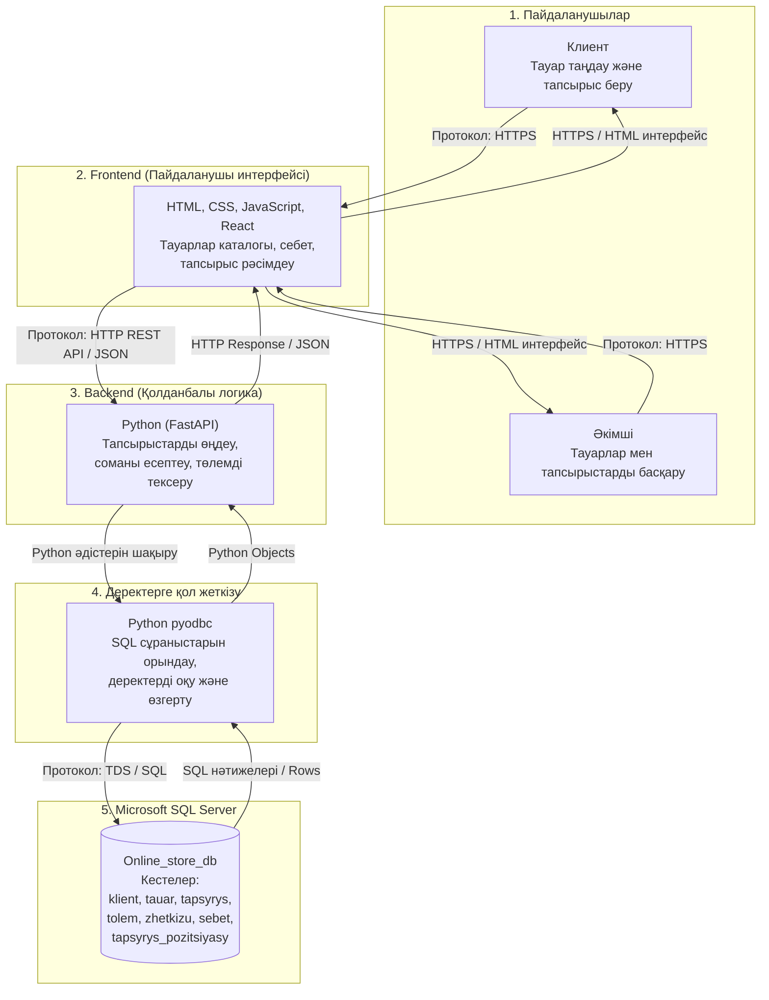

# 9-зертханалық жұмыс
## Интернет-дүкеннің үш деңгейлі архитектурасы

```mermaid
graph TD
    subgraph Client ["1. Пайдаланушылар"]
        A1["Клиент<br/>Тауар таңдау және тапсырыс беру"]
        A2["Әкімші<br/>Тауарлар мен тапсырыстарды басқару"]
    end

    subgraph Presentation ["2. Frontend (Пайдаланушы интерфейсі)"]
        B["HTML, CSS, JavaScript, React<br/>Тауарлар каталогы, себет,<br/>тапсырыс рәсімдеу"]
    end

    subgraph Business ["3. Backend (Қолданбалы логика)"]
        C["Python (FastAPI)<br/>Тапсырыстарды өңдеу,<br/>соманы есептеу, төлемді тексеру"]
    end

    subgraph DataAccess ["4. Деректерге қол жеткізу"]
        D["Python pyodbc<br/>SQL сұраныстарын орындау,<br/>деректерді оқу және өзгерту"]
    end

    subgraph Database ["5. Microsoft SQL Server"]
        E[("Online_store_db<br/>Кестелер:<br/>klient, tauar, tapsyrys,<br/>tolem, zhetkizu, sebet,<br/>tapsyrys_pozitsiyasy")]
    end

    %% Сұраныстардың жіберілу бағыты
    A1 & A2 -->|"Протокол: HTTPS"| B
    B -->|"Протокол: HTTP REST API / JSON"| C
    C -->|"Python әдістерін шақыру"| D
    D -->|"Протокол: TDS / SQL"| E

    %% Жауаптардың қайту бағыты
    E -->|"SQL нәтижелері / Rows"| D
    D -->|"Python Objects"| C
    C -->|"HTTP Response / JSON"| B
    B -->|"HTTPS / HTML интерфейс"| A1 & A2
```