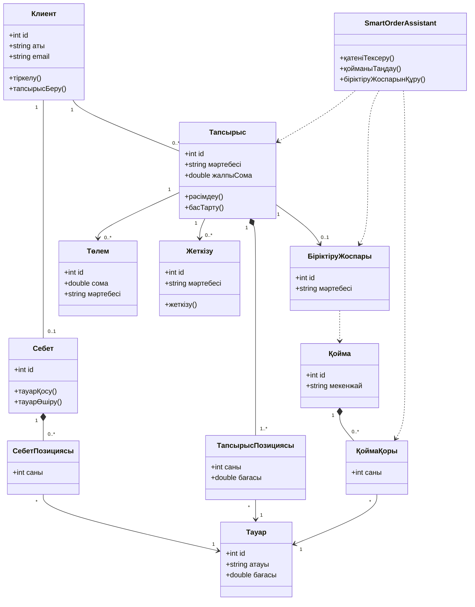

```mermaid
classDiagram
direction TB

class Клиент {
    +int id
    +string аты
    +string email
    +тіркелу()
    +тапсырысБеру()
}

class Себет {
    +int id
    +тауарҚосу()
    +тауарӨшіру()
}

class СебетПозициясы {
    +int саны
}

class Тауар {
    +int id
    +string атауы
    +double бағасы
}

class Тапсырыс {
    +int id
    +string мәртебесі
    +double жалпыСома
    +рәсімдеу()
    +басТарту()
}

class ТапсырысПозициясы {
    +int саны
    +double бағасы
}

class SmartOrderAssistant {
    +қатеніТексеру()
    +қойманыТаңдау()
    +біріктіруЖоспарынҚұру()
}

class Қойма {
    +int id
    +string мекенжай
}

class ҚоймаҚоры {
    +int саны
}

class БіріктіруЖоспары {
    +int id
    +string мәртебесі
}

class Төлем {
    +int id
    +double сома
    +string мәртебесі
}

class Жеткізу {
    +int id
    +string мәртебесі
    +жеткізу()
}

Клиент "1" -- "0..1" Себет
Клиент "1" -- "0..*" Тапсырыс

Себет "1" *-- "0..*" СебетПозициясы
СебетПозициясы "*" --> "1" Тауар

Тапсырыс "1" *-- "1..*" ТапсырысПозициясы
ТапсырысПозициясы "*" --> "1" Тауар

Қойма "1" *-- "0..*" ҚоймаҚоры
ҚоймаҚоры "*" --> "1" Тауар

Тапсырыс "1" --> "0..*" Төлем
Тапсырыс "1" --> "0..*" Жеткізу
Тапсырыс "1" --> "0..1" БіріктіруЖоспары

SmartOrderAssistant ..> Тапсырыс
SmartOrderAssistant ..> ҚоймаҚоры
SmartOrderAssistant ..> БіріктіруЖоспары

БіріктіруЖоспары ..> Қойма
```
