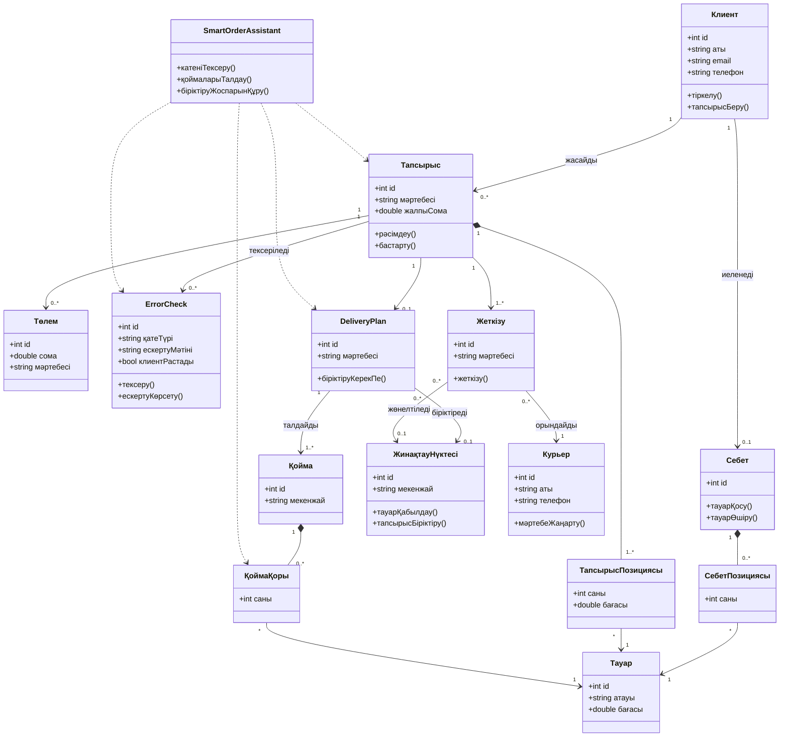

# Class Diagram — Smart Order Assistant

```mermaid
classDiagram
    direction TB

    class Клиент {
        +int id
        +string аты
        +string email
        +string телефон
        +тіркелу()
        +тапсырысБеру()
    }
    class Себет {
        +int id
        +тауарҚосу()
        +тауарӨшіру()
    }
    class СебетПозициясы {
        +int саны
    }
    class Тауар {
        +int id
        +string атауы
        +double бағасы
    }
    class Тапсырыс {
        +int id
        +string мәртебесі
        +double жалпыСома
        +рәсімдеу()
        +бастарту()
    }
    class ТапсырысПозициясы {
        +int саны
        +double бағасы
    }
    class Төлем {
        +int id
        +double сома
        +string мәртебесі
    }
    class ErrorCheck {
        +int id
        +string қатеТүрі
        +string ескертуМәтіні
        +bool клиентРастады
        +тексеру()
        +ескертуКөрсету()
    }
    class SmartOrderAssistant {
        +катеніТексеру()
        +қоймаларыТалдау()
        +біріктіруЖоспарынҚұру()
    }
    class DeliveryPlan {
        +int id
        +string мәртебесі
        +біріктіруКерекПе()
    }
    class Қойма {
        +int id
        +string мекенжай
    }
    class ҚоймаҚоры {
        +int саны
    }
    class ЖинақтауНүктесі {
        +int id
        +string мекенжай
        +тауарҚабылдау()
        +тапсырысБіріктіру()
    }
    class Жеткізу {
        +int id
        +string мәртебесі
        +жеткізу()
    }
    class Курьер {
        +int id
        +string аты
        +string телефон
        +мәртебеЖаңарту()
    }

    Клиент "1" --> "0..*" Тапсырыс : жасайды
    Клиент "1" --> "0..1" Себет : иеленеді
    Себет "1" *-- "0..*" СебетПозициясы
    СебетПозициясы "*" --> "1" Тауар
    Тапсырыс "1" *-- "1..*" ТапсырысПозициясы
    ТапсырысПозициясы "*" --> "1" Тауар
    Тапсырыс "1" --> "0..*" Төлем
    Тапсырыс "1" --> "0..*" ErrorCheck : тексеріледі
    Тапсырыс "1" --> "0..1" DeliveryPlan
    Тапсырыс "1" --> "1..*" Жеткізу
    DeliveryPlan "1" --> "1..*" Қойма : талдайды
    DeliveryPlan "0..*" --> "0..1" ЖинақтауНүктесі : біріктіреді
    Жеткізу "0..*" --> "0..1" ЖинақтауНүктесі : жөнелтіледі
    Жеткізу "0..*" --> "1" Курьер : орындайды
    Қойма "1" *-- "0..*" ҚоймаҚоры
    ҚоймаҚоры "*" --> "1" Тауар

    SmartOrderAssistant ..> Тапсырыс
    SmartOrderAssistant ..> ErrorCheck
    SmartOrderAssistant ..> DeliveryPlan
    SmartOrderAssistant ..> ҚоймаҚоры
```
