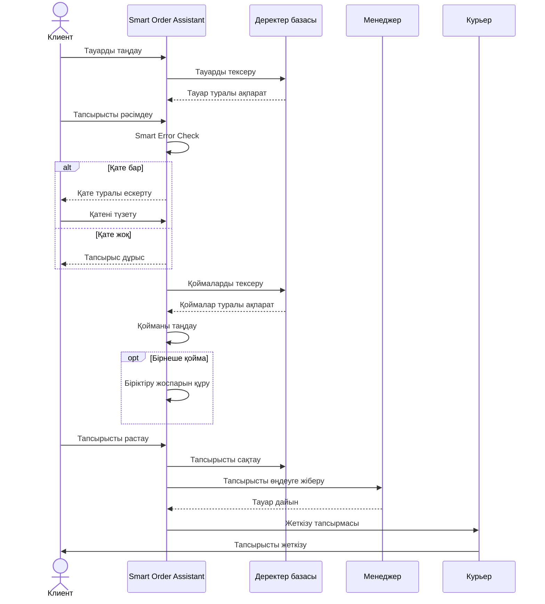

```mermaid
sequenceDiagram
    actor C as Клиент
    participant S as Smart Order Assistant
    participant DB as Деректер базасы
    participant M as Менеджер
    participant K as Курьер

    C->>S: Тауарды таңдау
    S->>DB: Тауарды тексеру
    DB-->>S: Тауар туралы ақпарат

    C->>S: Тапсырысты рәсімдеу
    S->>S: Smart Error Check

    alt Қате бар
        S-->>C: Қате туралы ескерту
        C->>S: Қатені түзету
    else Қате жоқ
        S-->>C: Тапсырыс дұрыс
    end

    S->>DB: Қоймаларды тексеру
    DB-->>S: Қоймалар туралы ақпарат
    S->>S: Қойманы таңдау

    opt Бірнеше қойма
        S->>S: Біріктіру жоспарын құру
    end

    C->>S: Тапсырысты растау
    S->>DB: Тапсырысты сақтау
    S->>M: Тапсырысты өңдеуге жіберу
    M-->>S: Тауар дайын
    S->>K: Жеткізу тапсырмасы
    K->>C: Тапсырысты жеткізу
```
